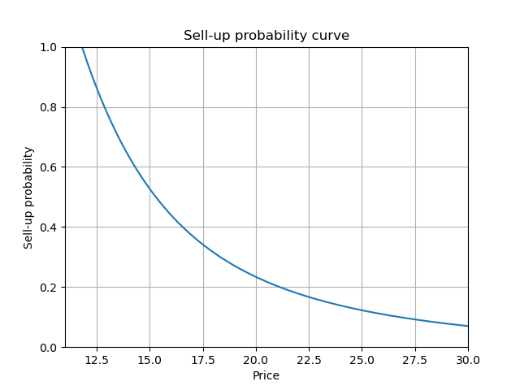
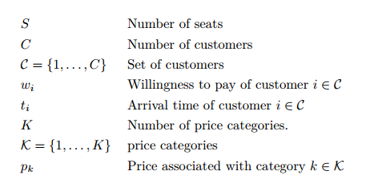
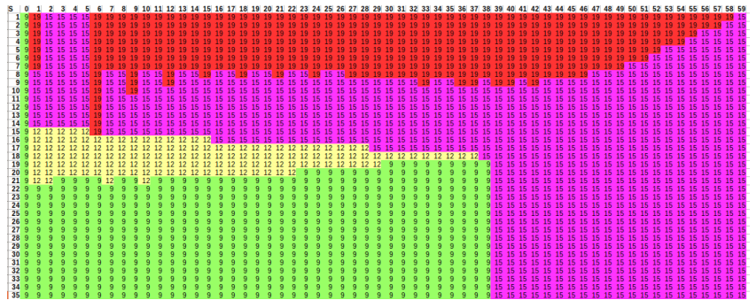

# ticket-pricing
This project is about dynamic optimization of ticket pricing for a perishable product. Examples are

* a bus trip with a limited number of seats that departs at a given date and time
* an event with a limited number of seats that takes place at a given date
* a limited quantity of a perishable product with a given expiry date

The task is to determine the optimal price over time until the product perishes. Each customer has a so called *willingness to pay* (WP) that determines the highest price she would pay to receive a ticket. Customers are assumed to be individuals (not groups) purchasing one item. In the best case, each customer purchases a ticket for a price equal to her WP, and if the capacity does not suffice the customers with a low WP do not receive items. 

Assume that the distributions of customers' WP is approximated using a so called *sell-up probability curve*. It gives the share of clients that are  willing to pay a given price or more. 

   

 

where pi is the price for the i-th item, or alternativel, 

(k1, k2, ... , kS)

where ki is the price category for the i-th item.

A policy that sells tickets at non-decreasing (non-increasing) prices may be called monotone. If the prices are from the given set of price categories, a monotone policy can be represented as shown above or more concisely by 

(x1, x2, ... , xK)

where xk is number of items sold in category k. The items are sold for the lowest price first, and once all items of a category are sold, the tickets are sold in the next category. Note that a pricing policy that is observed by customers to be not non-decreasing may lead to customers delaying
their purchase in the hope to get a better deal in the future. From a computational point of view, it is interesting to know, how many policies exist. Since S items (distinguishable by the order in which they are sold) are assigned to K price categories there are K^S policies. If we restrict the set of eligible policies to non-decreasing policies, S non-distinguishable seats are assigned to 4
price categories. The seats are not distinguishable because the order is not determined by the categories Hence, the number of policies is 

K +SS − 1 

a much smaller number!

To better understand the problem, let’s look at some trivial special cases.

### Special case: deterministic predictions and customer arrival times
Assume that the number of customers is known to be C ≤ S, and that each customer’s WP wi as well her arrival time ti is known. Then the order in which customers arrive is known, say (i1; i2 : : : ; iC) 2 CC. Then we can simply sell tickets for the prices (wi1; wi2; : : : ; wiC ) to receive the optimal value PC i=1 wi. In the capacitated case, we simply set the prices such that the C − S customers with lowest wi do not receive a seat. Obviously, even if the assumptions were realistic, such a pricing policy would be perceived as rip off-ish.

### Special case: deterministic predictions, low WP first.
If each customer’s WP wi is known, and customers arrive in order (i1; i2; : : : ; in) with wi1 ≤ wi2 ≤ : : : ≤ win, we again can sell tickets for the prices (wi1; wi2; : : : ; win) to receive the optimal value Pi wi. But now the policy is non-decreasing and can be represented by (x1; x2; x3; x4) as introduced above. The optimal solution using this representation is (g1; g2; g3; g4). In the capacitated case, we decrease g1 then g2 and so on until Pk gk = S.

# A Markov Decision Process Model

To model the *Markov Decision Process* (MDP), the following assumptions are made:

* Decisions are made at discrete points in time.
* Between two decisions, either one or zero customers show up.
* The capacity is limited.

Assume a finite planning horizon that starts at time *1* and ends at time *T*, where time *T* represents the time when the product perishes (e.g. the end of the booking period). The notation is summarized in the table below.

### State

The state of the system at time t is the number of remaining seats denoted as zt.

### Decisions

The prices can be set dynamically, meaning that the price for the next period (t; t + 1) can be set at
time t depending on the state zt. Decision variable pt denotes the price for the next period.

### Transition & rewards

In this simple model, one customer arrives in period (t; t + 1) with probability pshow. If
a customer shows up, his WP is a random variable Wt. If a customer shows up in period t = (t; t + 1), and if his WP is at least as large as the current price, and if there are remaining items, we receive a reward of pt, and the number of available seats is decreased. Otherwise, the customer is lost. The reward function is defined accordingly as

// TODO: insert image of reward function

### Algorithm

The model can be easily solved with classical *backward dynamic programming* (DP).

##  Results

Based on the exemplary setup, the decision is structured as illustrated in the following figure. The remaining capacity is on the vertical axis and the time on the horizontal axis.
